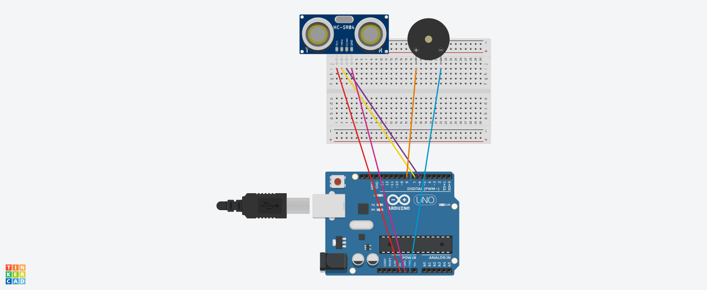

# 🚗 Arduino Araç Park Sistemi (PAEK)

<div align="center">
  
</div>

---

## 📋 Proje Hakkında

Bu proje, araçların park ederken yakın çevredeki nesneleri algılamasına yardımcı olan bir **Park Destek Sistemi (PAEK)**'dir. Arduino UNO, HC-SR04 ultrasonik sensör ve pasif buzzer kullanılarak geliştirilmiş, gerçek araç park sensörlerinin küçük ölçekli bir simülasyonudur.

### 🎯 Proje Amacı
- Ultrasonik sensör ile mesafe ölçümü yapma
- Nesneye yaklaşıldıkça artan frekansta sesli uyarı verme
- Arduino ile elektronik programlama temellerini öğrenme
- Gerçek dünya uygulamaları için pratik deneyim kazanma

---

## 🛠️ Donanım Gereksinimleri

| Komponent | Miktar | Açıklama |
|-----------|---------|----------|
| Arduino UNO | 1 adet | Ana kontrol kartı |
| HC-SR04 Ultrasonik Sensör | 1 adet | Mesafe ölçüm sensörü |
| Pasif Buzzer | 1 adet | Sesli uyarı için |
| Breadboard | 1 adet | Devre kurulum tahtası |
| Jumper Kablolar | 5 adet | Bağlantı kabloları |
| USB Kablo | 1 adet | Arduino programlama için |

---

## 🔌 Devre Şeması

<div align="center">
  
</div>

### Pin Bağlantıları

```
HC-SR04 Ultrasonik Sensör:
├── VCC    → Arduino 5V
├── GND    → Arduino GND
├── Trig   → Arduino Pin 7
└── Echo   → Arduino Pin 6

Pasif Buzzer:
├── (+)    → Arduino Pin 8
└── (-)    → Arduino GND
```

---

## 💻 Kod Açıklaması

### Ana Kod Yapısı

```cpp
// Pin tanımlamaları
#define echoPin 6        // Sensör yankı sinyali
#define trigPin 7        // Sensör tetik sinyali
#define buzzerPin 8      // Buzzer kontrol pini

void setup() {
  pinMode(trigPin, OUTPUT);
  pinMode(echoPin, INPUT);
  pinMode(buzzerPin, OUTPUT);
  Serial.begin(9600);
}

void loop() {
  int distance = getDistance();
  
  // Mesafe kontrolü ve ses üretimi
  if (distance == 0 || distance > 50) {
    noTone(buzzerPin);
    delay(300);
  } else {
    int delayTime = map(distance, 5, 50, 50, 1000);
    tone(buzzerPin, 1000);
    delay(delayTime);
    noTone(buzzerPin);
    delay(delayTime);
  }
}

int getDistance() {
  // Ultrasonik mesafe ölçüm fonksiyonu
  long duration;
  
  digitalWrite(trigPin, LOW);
  delayMicroseconds(2);
  digitalWrite(trigPin, HIGH);
  delayMicroseconds(10);
  digitalWrite(trigPin, LOW);
  
  duration = pulseIn(echoPin, HIGH);
  int distance = duration / 58.2;
  
  return (distance <= 0 || distance > 200) ? 0 : distance;
}
```

### Algoritma Mantığı

1. **Mesafe Ölçümü**: HC-SR04 sensörü ses dalgalarını kullanarak mesafe ölçer
2. **Sinyal İşleme**: Ölçülen mesafe değerine göre buzzer frekansı hesaplanır
3. **Uyarı Sistemi**: Yaklaştıkça ses aralığı kısalır (5cm-50cm arası aktif)
4. **Güvenlik**: Hatalı ölçümlerde sistem susturulur

---

## 🚀 Kurulum ve Çalıştırma

### Adım 1: Arduino IDE Kurulumu
```bash
# Arduino IDE'yi resmi siteden indirin
# https://www.arduino.cc/en/software
```

### Adım 2: Devre Kurulumu
1. Arduino UNO'yu bilgisayarınıza bağlayın
2. Breadboard üzerinde devre şemasına göre bağlantıları yapın
3. Tüm bağlantıları kontrol edin

### Adım 3: Kod Yükleme
1. `arac-park-sistemi.ino` dosyasını Arduino IDE'de açın
2. Doğru kart ve port seçimini yapın
3. Kodu Arduino'ya yükleyin

### Adım 4: Test
1. Seri monitörü açın (9600 baud)
2. Sensörün önüne nesne yaklaştırın
3. Mesafe değerlerini ve ses değişimini gözlemleyin

---

## 📊 Performans Özellikleri

| Özellik | Değer |
|---------|-------|
| Ölçüm Aralığı | 5-50 cm |
| Ölçüm Hassasiyeti | ±2 cm |
| Ses Frekansı | 1000 Hz |
| Güncelleme Hızı | ~3 okuma/saniye |
| Güç Tüketimi | <50 mA |

---

## 🎮 Kullanım Senaryoları

### 🏠 Ev Garaju
- Araç park ederken duvar mesafesi kontrolü
- Bisiklet veya motosiklet park yardımı

### 🏗️ Proje Geliştirme
- Arduino öğrenim projesi
- Sensör programlama eğitimi
- Elektronik prototipleme

### 🔧 Genişletme İmkanları
- LED gösterge ekleme
- Farklı ses tonları
- Drahtlos (kablosuz) iletişim
- Mobil uygulama entegrasyonu

---

## 🐛 Sorun Giderme

### Yaygın Sorunlar

**Problem**: Sensör sürekli 0 cm gösteriyor
- **Çözüm**: Bağlantıları kontrol edin, sensör önünde engel olmasın

**Problem**: Buzzer ses çıkarmıyor
- **Çözüm**: Pasif buzzer kullandığınızdan emin olun, kutupları kontrol edin

**Problem**: Mesafe ölçümü hatalı
- **Çözüm**: Sensör düzgün konumlandırın, 5V beslemesini kontrol edin

### Debug İpuçları

```cpp
// Seri monitörde detaylı bilgi için:
Serial.print("Mesafe: ");
Serial.print(distance);
Serial.println(" cm");
```

---

## 🔄 Gelecek Geliştirmeler

- [ ] RGB LED gösterge sistemi
- [ ] Farklı mesafe aralıkları için farklı ses tonları
- [ ] OLED ekran entegrasyonu
- [ ] Bluetooth ile mobil uygulama kontrolü
- [ ] Çoklu sensör desteği

---

## 👥 Katkıda Bulunma

Bu proje açık kaynak kodludur. Katkılarınızı bekliyoruz!

1. Bu repository'yi fork edin
2. Yeni feature branch oluşturun (`git checkout -b feature/yeni-ozellik`)
3. Değişikliklerinizi commit edin (`git commit -m 'Yeni özellik eklendi'`)
4. Branch'inizi push edin (`git push origin feature/yeni-ozellik`)
5. Pull Request oluşturun

---

## 📞 İletişim

<div align="center">
  
**Fadime Öcal**  
Software Engineer  
📧 fadimeocal.dev@gmail.com  

---

*Bu proje Arduino ile elektronik programlama öğrenmek isteyenler için hazırlanmıştır.*  
*Sorularınız ve önerileriniz için lütfen iletişime geçin.*

</div>

---

## 📄 Lisans

Bu proje MIT lisansı altında lisanslanmıştır. Detaylar için [LICENSE](LICENSE) dosyasını inceleyebilirsiniz.

---

<div align="center">
  <sub>💖 Fadime Öcal tarafından sevgiyle kodlanmıştır</sub>
</div>